近期我在 SpringBoot 的小册交流群里碰见一个问题，感觉蛮有意思的，拿出来跟小伙伴们分享一下。

## 原问题

那位小伙伴的项目中，有**一部分 Service 的注解事务一直不起作用**，但也只是一部分起作用，**也有一部分是好的**。而且更奇怪的是，如果他把一个事务不起作用的 ServiceImpl 代码完整的抄一遍到新的复制类里头，那个类居然是有事务的！


## 初步分析

咱回想一下，按常理来讲，SpringFramework 中的事务不生效，大概有这么几种情况：

* `@Transactional` 注解标注在非 public 方法上
* `@Transactional` 注解标注在接口上，但实现类使用 Cglib 代理
* `@Transactional` 注解标注抛出 `Exception` ，默认不捕捉
* service 方法中自行 `try-catch` 了异常但没有再抛出 `RuntimeException` 
* 原生 SSM 开发中，父子容器一起包扫描，会导致子容器先扫描到 service 并注册到子容器中但不加载事务，之后虽然父容器也扫描到 service 但因为子容器中的 controller 已经注入了没有事务代理的 service ，会导致事务失效
* 声明式事务的配置必须由父 IOC 容器加载，SpringWebMvc 的子 IOC 容器加载不生效

除此之外，如果使用的关系型数据库是 MySQL ，还要关注是否为 InnoDB 引擎（ MyISAM 不支持事务）。

结果小伙伴一通分析，发现这上面罗列的情况都没有出现，排查难度进一步加大。


## 新的关注点

隔了大概半天吧，那位小伙伴突然发现了一点问题：他们的项目使用了 **Shiro** 作为权限校验框架，而且那些**事务失效的 Service 刚好就是被 Shiro 中自定义 Realm 依赖的 Service** ！有了这个线索，下面排查起来就容易一些了。


## 问题复现

咱也自己搞一套，看看是不是像他说的那样吧！

#### 工程搭建

为了快速复现这个问题，咱使用 SpringBoot + `shiro-spring-boot-web-starter` 构建。( SpringBoot 版本只要在 2.x 就可以，本文测试功能选用 2.2.8 )

##### pom

关键的依赖有下面 4 个：

```xml
<dependency>
    <groupId>org.springframework.boot</groupId>
    <artifactId>spring-boot-starter-web</artifactId>
</dependency>

<dependency>
    <groupId>org.springframework.boot</groupId>
    <artifactId>spring-boot-starter-jdbc</artifactId>
</dependency>
<dependency>
    <groupId>org.apache.shiro</groupId>
    <artifactId>shiro-spring-boot-web-starter</artifactId>
    <version>1.5.3</version>
</dependency>

<dependency>
    <groupId>com.h2database</groupId>
    <artifactId>h2</artifactId>
    <version>1.4.199</version>
</dependency>
```

##### Realm

Shiro 的自定义策略核心就是 **`Realm`** ，咱也不整那些花里胡哨的，直接糊弄下算了。

```java
public class CustomRealm extends AuthorizingRealm {
    
    @Override
    protected AuthenticationInfo doGetAuthenticationInfo(AuthenticationToken token) throws AuthenticationException {
        if (token.getPrincipal() == null) {
            return null;
        }
        String name = token.getPrincipal().toString();
        // 请求数据库查询是否存在用户，这里省略
        return new SimpleAuthenticationInfo(name, "123456", getName());
    }
    
    @Override
    protected AuthorizationInfo doGetAuthorizationInfo(PrincipalCollection principals) {
        SimpleAuthorizationInfo authorizationInfo = new SimpleAuthorizationInfo();
        // 请求数据库/缓存加载用户的权限，这里暂时使用一组假数据
        authorizationInfo.addStringPermissions(Arrays.asList("aa", "bb", "cc"));
        return authorizationInfo;
    }
}
```

##### 配置类

只声明 Realm 还不够，需要定义几个 Bean 来补充必需的组件才行。

```java
@Configuration
public class ShiroConfiguration {
    
    // 自定义Realm注册
    @Bean
    public CustomRealm authorizer() {
        return new CustomRealm();
    }
    
    // 动态代理创建器（上面没有导入AOP）
    @Bean
    public DefaultAdvisorAutoProxyCreator advisorAutoProxyCreator() {
        DefaultAdvisorAutoProxyCreator advisorAutoProxyCreator = new DefaultAdvisorAutoProxyCreator();
        advisorAutoProxyCreator.setProxyTargetClass(true);
        return advisorAutoProxyCreator;
    }
    
    // 过滤器定义，此处选择全部放行，方便调试
    @Bean
    public ShiroFilterChainDefinition filterChainDefinition() {
        DefaultShiroFilterChainDefinition filterChainDefinition = new DefaultShiroFilterChainDefinition();
        filterChainDefinition.addPathDefinition("/**", "anon");
        return filterChainDefinition;
    }
}
```

##### 数据库配置

快速搭建临时测试的、结构很简单的数据库，选择 h2 内存数据库更为合适。

`application.properties` 中配置 h2 的数据源及初始化数据库的 SQL ：

```properties
spring.datasource.driver-class-name=org.h2.Driver
spring.datasource.url=jdbc:h2:mem:shiro-test
spring.datasource.username=sa
spring.datasource.password=sa
spring.datasource.platform=h2

spring.datasource.schema=classpath:sql/schema.sql
spring.datasource.data=classpath:sql/data.sql

spring.h2.console.settings.web-allow-others=true
spring.h2.console.path=/h2
spring.h2.console.enabled=true
```

`resources` 目录下创建 sql 文件夹，并创建两个 .sql 文件，分别声明数据库表的结构和数据：

```sql
create table if not exists sys_department (
   id varchar(32) not null primary key,
   name varchar(32) not null
);

---

insert into sys_department (id, name) values ('idaaa', 'testaaa');
insert into sys_department (id, name) values ('idbbb', 'testbbb');
insert into sys_department (id, name) values ('idccc', 'testccc');
insert into sys_department (id, name) values ('idddd', 'testddd');
```

#### 编写测试代码

下面就可以按照三层架构来写一些很简单的测试代码了。

##### DemoDao

这里咱就不整合 MyBatis / Hibernate 了，直接使用原生的 `JdbcTemplate` 就可以：

```java
@Repository
public class DemoDao {
    
    @Autowired
    JdbcTemplate jdbcTemplate;
    
    public List<Map<String, Object>> findAll() {
        return jdbcTemplate.query("select * from sys_department", new ColumnMapRowMapper());
    }
    
    public int save(String name) {
        return jdbcTemplate.update("insert into sys_department (id, name) values (?, ?)",
                UUID.randomUUID().toString().replaceAll("-", ""), name);
    }
    
    public int update(String id, String name) {
        return jdbcTemplate.update("update sys_department set name = ? where id = ?", name, id);
    }
}
```

##### DemoService + DemoService2

声明一个会触发抛出运行时异常的方法，并标注 `@Transactional` 注解：

```java
@Service
public class DemoService {
    
    @Autowired
    DemoDao demoDao;
    
    @Transactional(rollbackFor = Exception.class)
    public void doTransaction() {
        demoDao.save("aaaaaaaa");
        int i = 1 / 0;
        demoDao.update("18", "ccc");
    }
}
```

`DemoService2` 同样的代码，仅仅是类名不同，代码不再贴出。

##### DemoController

Controller 里面同时依赖这两个 Service ：

```java
@RestController
public class DemoController {
    
    @Autowired
    DemoService demoService;
    
    @Autowired
    DemoService2 demoService2;
    
    @GetMapping("/doTransaction")
    public String doTransaction() {
        demoService.doTransaction();
        return "doTransaction";
    }
    
    @GetMapping("/doTransaction2")
    public String doTransaction2() {
        demoService2.doTransaction();
        return "doTransaction2";
    }
}
```

#### Realm依赖Service

最后，让自定义的 Realm 依赖咱刚写的 `DemoService` ：

```java
public class CustomRealm extends AuthorizingRealm {
    
    @Autowired
    DemoService demoService;
    // ......
```

#### 运行测试

运行 SpringBoot 的主启动类，在浏览器输入 `http://localhost:8080/h2` 输入刚才在 properties 文件中声明的配置，即可打开 h2 数据库的管理台。

执行 `SELECT * FROM SYS_DEPARTMENT` ，可以发现数据已经成功初始化了：

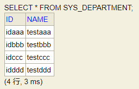

下面测试事务，在浏览器输入 `localhost:8080/doTransaction` ，浏览器自然会报除零异常，但刷新数据库，会发现数据库真的多了一条 insert 过去的数据！请求 `/doTransaction2` 则不会插入新的数据。

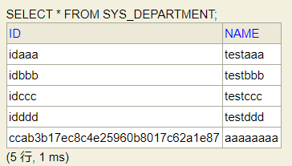

到这里，问题就真的发生了，下面要想办法解决这个问题才行。


## 问题排查

既然两个 Service 在代码上完全一致，只是一个被 Realm 依赖了，一个没有依赖而已，那总不能是这两个 Service 本来就不一样吧！

#### 检查两个Service对象

将断点打在 `/doTransaction` 对应的方法上，Debug 重新启动工程，待断点落下后，发现被 Realm 依赖的 `DemoService` 不是代理对象，而没有被 Realm 依赖的 `DemoService2` 经过事务的增强，成为了一个代理对象：

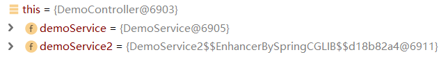

所以由此就可以看到问题所在了吧！上面的那个 `DemoService` 都没经过事务代理，凭什么能支持事务呢？？？

#### 检查Service的创建时机

既然两个 Service 都不是一个样的，那咱就看看这俩对象都啥时候创建的吧！给 `DemoService` 上显式的添加上无参构造方法，方便过会 Debug ：

```java
@Service
public class DemoService {
    
    public DemoService() {
        System.out.println("DemoService constructor run ......");
    }
```

重新以 Debug 运行，等断点打在构造方法中，观察方法调用栈：

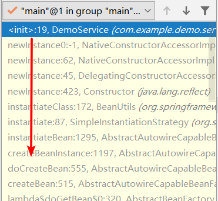

看上去还比较正常吧，但如果往下拉到底，这问题就太严重了：

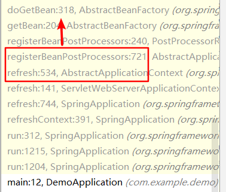

哦，合着我这个 `DemoService` 在 **`refresh` 方法的后置处理器注册步骤就已经创建好了**啊！小伙伴们要知道，SpringFramework 中 `ApplicationContext` 的初始化流程，一定是**先把后置处理器都注册好了，再创建单实例 Bean** 。但是这里很明显是后置处理器还没完全处理完，就引发单实例 Bean 的创建了！


## 问题解决

问题终于找明白了，咋解决呢？其实网上有的是现成的文章了：

[spring boot shiro 事务无效](https://blog.csdn.net/hzw2312/article/details/81030277)

[shiro导致springboot事务不起效解决办法](https://blog.csdn.net/yucaifu1989/article/details/79206369)

[spring + shiro 配置中部分事务失效分析及解决方案](https://blog.csdn.net/keliii/article/details/80051688)

总的来看，解决方案的核心在于：如何让 `Realm` 创建时不立即依赖创建 `DemoService` ，所以就有两种解决方案了：要么延迟初始化 `DemoService` ，要么**把自定义的 `Realm` 和 `SecurityManager` 放在一个额外的空间，利用监听器机制创建它们** 。具体的实现可以参照上面文章的写法，这里就不赘述了。


## 原理扩展

解决问题之后，如果能从这里面了解到一点更深入的原理知识，想必那是最好不过了。下面就这个问题出现的原因，以及上面 `@Lazy` 方案的原理，咱都深入解析一下。

#### Shiro提早创建Realm的原因

既然上面看到了方法调用栈中，`DemoService` 被自定义 `Realm` 依赖后在 `ApplicationContext` 的 `refresh` 阶段的 **`registerBeanPostProcessors`** 中就已经被触发创建，可它为什么非要搞这一出呢？自定义 `Realm` 放到 **`finishBeanFactoryInitialization`** 中统一创建不好吗？下面咱通过 Debug 研究问题的成因。

##### Debug运行

`DemoService` 中的断点不要去掉，重新 Debug 让断点停在那里，翻到最底下的调用栈，查看那个正在创建的 `BeanPostProcessor` ，发现它的名称是 `shiroEventBusAwareBeanPostProcessor` ：

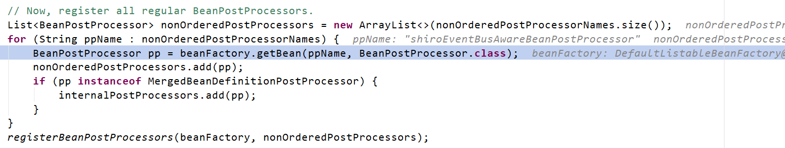

##### Shiro的后置处理器创建

翻开创建 `shiroEventBusAwareBeanPostProcessor` 的位置，在 `ShiroBeanAutoConfiguration` 中，它又依赖了一个 `EventBus` ：

```java
@Bean
@ConditionalOnMissingBean
@Override
public ShiroEventBusBeanPostProcessor shiroEventBusAwareBeanPostProcessor() {
    return super.shiroEventBusAwareBeanPostProcessor();
}

protected ShiroEventBusBeanPostProcessor shiroEventBusAwareBeanPostProcessor() {
    return new ShiroEventBusBeanPostProcessor(eventBus());
}
```

顺着方法调用栈往上爬，找到下一个 `doCreateBean` ，发现确实有创建 `eventBus` 的部分：

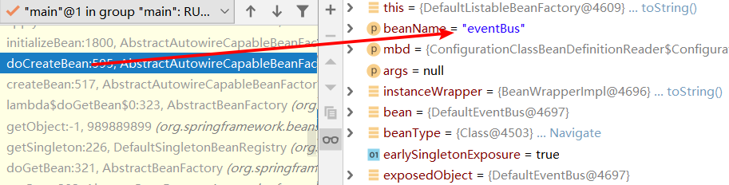

再往上爬，发现这上面有一个 `wrapIfNecessary` 方法的调用，很明显这是要搞 **AOP** 增强了啊：

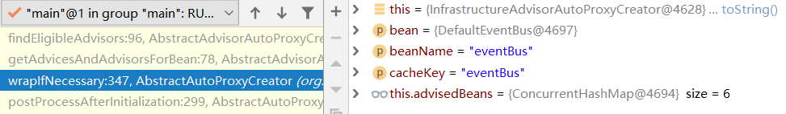

AOP 的增强需要先获取到增强器，继续往上爬方法调用，在 `findAdvisorBeans` 方法中找到了两个适配的增强器：

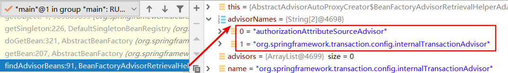

上面的是 Shiro 的授权相关的增强器，下面是 SpringFramework 中的事务控制增强器。

##### 触发AOP增强器的创建

根据迭代顺序，先取出下面的事务控制增强器 `TransactionAdvisor` ，由于获取到增强器的 Bean 也是需要走统一的 `getBean` 方法，所以在方法调用栈中，咱又一次看到了 `getBean` 方法，继续往下创建。

由于在 SpringFramework 中，使用 `@Configuration` + `@Bean` 声明的 Bean ，都是要**先把配置类初始化好，才能创建 Bean** 。所以继续往上爬调用栈时，会发现它并没有接着创建 Shiro 的增强器 `authorizationAttributeSourceAdvisor` ，而是先初始化了声明有 `TransactionAttributeSourceAdvisor` 的配置类 `ProxyTransactionManagementConfiguration` ：

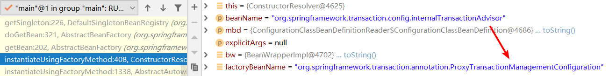

再往上走，发现又出现了一次 `wrapIfNecessary` 方法，说明**配置类也会被 AOP 增强**。那就重复一遍上面的步骤，继续遇到这两个增强器。

这个时候可能有小伙伴产生疑问了：这次创建就是因为上面的 `TransactionAttributeSourceAdvisor` 创建才跟过来的，这次还要再创建，这是闹哪出呢？放心，咱都想到这个问题了，人家写 SpringFramework 的大佬们能想不到吗？所以在创建之前，它加了一个判断：

```java
    if (this.beanFactory.isCurrentlyInCreation(name)) {
        // 如果当前bean正在创建，则跳过
        if (logger.isTraceEnabled()) {
            logger.trace("Skipping currently created advisor '" + name + "'");
        }
    }
    else {
        try {
            advisors.add(this.beanFactory.getBean(name, Advisor.class));
        }
```

这里巧妙的利用了 **`singletonsCurrentlyInCreation`** 这个集合，判断了当前增强器是否在创建，这样就不会出现重复创建无限死循环的问题了。

> `singletonsCurrentlyInCreation` 的存放是在 `getSingleton` 方法调用时就已经放进去了，所以能很稳妥的记录下当前正在创建的所有 Bean ，防止死循环重复创建。

##### Shiro增强器的创建

上面的事务控制增强器跳过去了，那就可以创建 Shiro 的增强器了：

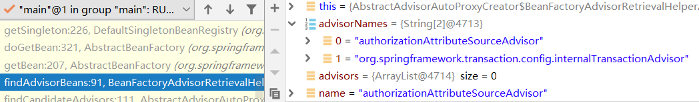

这次没有再出现那些幺蛾子，但是这个增强器本身依赖一个 `SecurityManager` ：

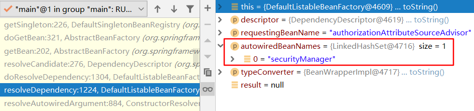

那就继续创建呗，创建 `SecurityManager` 的过程中又出现了新的依赖：

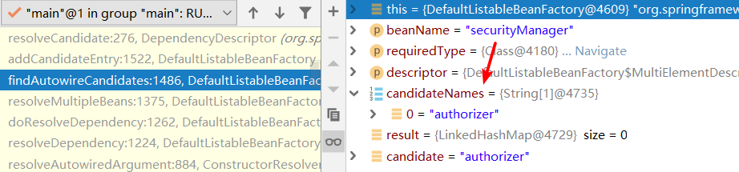

这个 `authorizer` ，就是咱上面在 `ShiroConfiguration` 中注册的自定义 `Realm` 。

看到这里了，后续的步骤想必不用我说小伙伴们也能自己想到了吧：**Realm 的创建又需要依赖 `DemoService` ，而 `DemoService` 在创建时由于事务控制增强器还没有创建好，所以无法代理 `DemoService` ，最终注入到 Realm 的 `DemoService` 就是不带事务的**。

##### 小结

捋一捋整个流程哈，整个创建过程经历了以下几个层级的依赖创建：

1. `ApplicationContext` 的 `refresh` 方法要创建 `BeanPostProcessor` 
2. `ShiroEventBusBeanPostProcessor` 的创建需要依赖 `EventBus`
3. `EventBus` 创建时需要被 AOP 增强，触发 AOP 增强器的创建逻辑
   
    > 此时 AOP 增强器有 2 个，分别是事务控制增强器，和 Shiro 的增强器
4. 首先创建事务控制的 AOP 增强器 `TransactionAttributeSourceAdvisor` ，由于它定义在配置类中，又触发配置类的创建
5. 配置类创建时也要被 AOP 增强，再一次触发 AOP 增强器的创建逻辑
   
    > 此时事务控制增强器正在被创建，所以被跳过了
6. 触发 Shiro 增强器的创建，而 Shiro 增强器又依赖 `SecurityManager`
7. `SecurityManager` 又依赖 `authorizer` ，也就是自定义的 `Realm` 
8. 自定义 `Realm` 依赖 `DemoService` ，触发 `DemoService` 的创建
9. `DemoService` 创建后要被事务 AOP 增强，但此时事务控制增强器还没有完全创建好，所以无法代理，导致 `DemoService` 不带事务


#### @Lazy解决该问题的原理

上面解决方案的第三篇文章，他提到可以用 `@Lazy` 注解解决问题，我在翻文章时有人说不能用（他把 `@Lazy` 注解标注到 `DemoService` 类上了），讲道理可能是他不会用才这么说的（￣へ￣）。其实用 `@Lazy` 注解是完全可行的，不过标注的位置要对，真正要标注的位置是自定义 `Realm` 的 `DemoService` 成员上：

```java
    @Autowired
    @Lazy
    DemoService demoService;
```

下面咱解释下为什么 `@Lazy` 标注在自定义 `Realm` 的依赖上好用，标注在 `DemoService` 类上不好用。

##### 测试-@Lazy标注在DemoService上

将 `@Lazy` 注解标注到 `DemoService` 的类上：

```java
    @Service
    @Lazy
    public class DemoService
```

重新 Debug ，发现断点落在 `DemoService` 的构造方法时，`refresh` 的动作仍然停在 `registerBeanPostProcessors` 步骤，说明将 `@Lazy` 标注在 `DemoService` 上是不可行的，这也就是上面我提的那个文章里说 `@Lazy` 不可行。

##### 测试-@Lazy标注在自定义Realm的依赖上

去掉上面 `DemoService` 类上的 `@Lazy` ，在自定义 `Realm` 的 `DemoService` 依赖上标注，重新 Debug，观察断点停下时 `refresh` 执行的步骤：

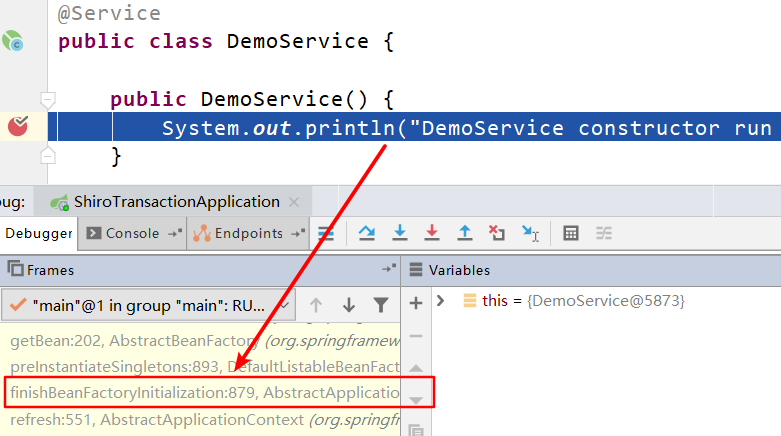

可以发现已经到了可以正常初始化单实例 Bean 的时机了，此时创建的 `DemoService` 就不会有问题了。

放行断点，待应用启动完成后，浏览器再发送 `/doTransaction` 的请求，发现这次事务已经生效了。

到这里，就验证了 `@Lazy` 的正确使用方法。

但是！！！不要着急！下面咱再扩展一点原理哈 ~ ~ ~

想一下，此时这个 `DemoService` 是啥玩意触发创建的？

答案很明显是 **`DemoController`** ，因为 Controller 还依赖着 Service 呢。

##### 测试-@Lazy标注Realm+Controller

继续测试，把自定义 `Realm` 和 `DemoController` 两个类的 `DemoService` 依赖都标注上 `@Lazy` ，重新 Debug ，待断点停下后，想一下此时 `DemoService` 又是谁触发它创建的呢？

答案也不难猜，是 **IOC 容器本身**创建的，因为 `DemoService` 所有被依赖的关系都延迟加载了，但 **IOC 容器本身还要预先创建好所有的单实例 Bean** ，所以 `DemoService` 还是在 IOC 容器启动的过程中创建了。

##### 测试-@Lazy全标注

继续，这次把 `DemoService` 上也标注上 `@Lazy` ，重新 Debug ，这次应用没有落在断点上直接启动了，说明 IOC 容器本身发现 `DemoService` 也可以延迟创建，就跳过去了，所以 IOC 容器初始化的全过程中 `DemoService` 都没有创建。

##### 小结

总结一下 `@Lazy` 的使用规则和对应的原理：

* `@Lazy` 标注在 Bean 的类上：告诉 IOC 容器，在**容器初始化阶段不要实例化**我
* `@Lazy` 标注在其他 Bean 的依赖上：告诉 IOC 容器，在创建这个标注了 `@Lazy` 的 Bean 时，**不要立即处理**我标注的这个**依赖**